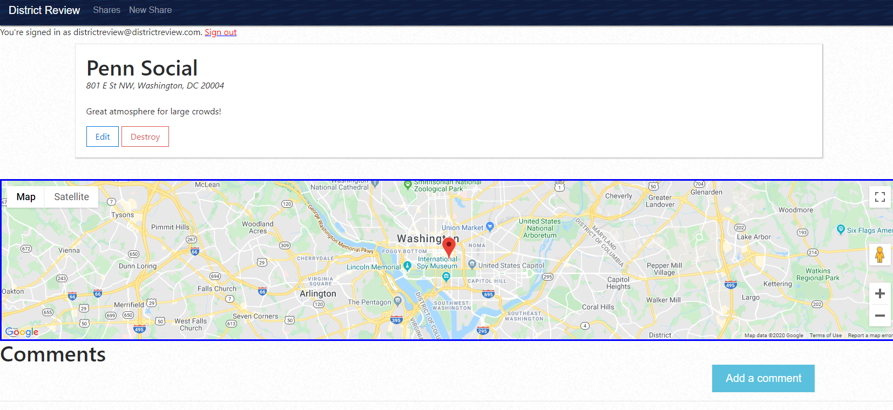
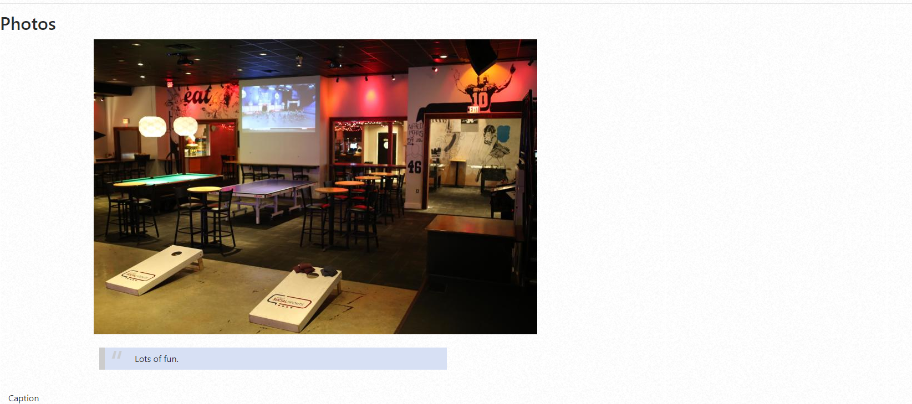
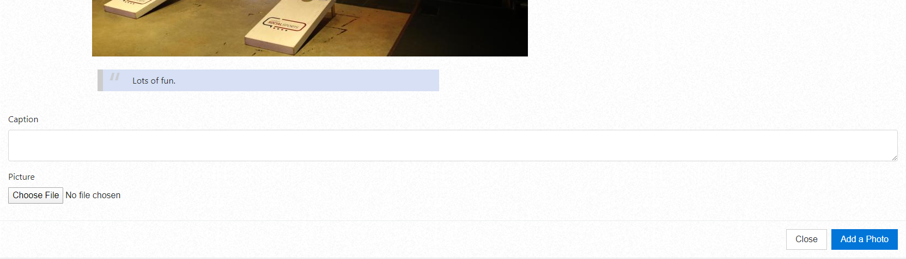

# OVERVIEW

* User-friendly app for users to share and suggest places to meet and watch local D.C. sporting events.
*  View the app here: <a href="https://districtreview-nick-parsley.herokuapp.com/">District Review</a>

# HOME PAGE

* The user will be sent to a home page with options to sign in, sign up, view shares and/or create new shares.

# SHARES

* A list of all shares created by signed-in users will be displayed here.  

* Each share listed can be viewed by clicking on the name.  THe user will be sent to a new page with information, pictures, and comments about the share.
* Locations are pinned and displayed on the map if the address provided is recognized.

# USERS

* Users must be signed in to create a new share, or add a comment or photo for an existing share.  
